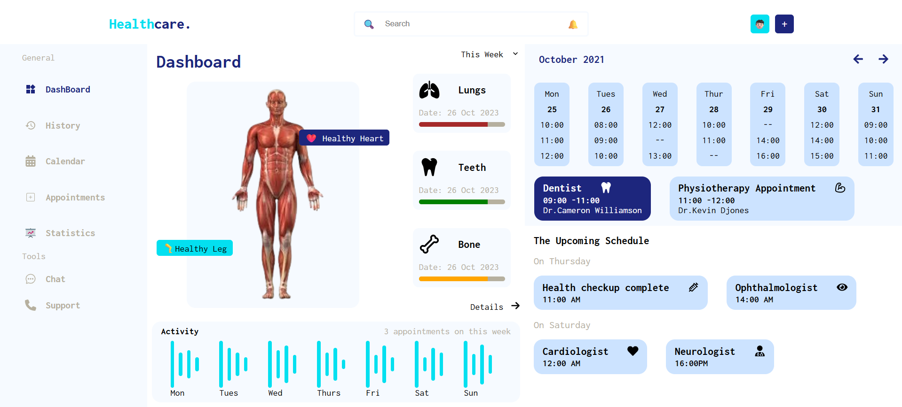

# 🩺 Healthcare Dashboard

A modern and interactive healthcare dashboard built with **React**, designed to manage and visualize patient appointments, health statuses, and weekly schedules in a sleek and user-friendly interface.



---

## 🌐 Live Demo

🚀 [View Live Demo](https://72umesh.github.io/Healthcare-Dashboard/)

---

## 📌 Features

- 🧍‍♂️ Interactive Human Body Highlights (e.g., Healthy Heart, Healthy Leg)
- 📅 Weekly Calendar with Appointments
- 🦷 Upcoming Schedule Cards with Doctor Info
- 📊 Activity Graph showing Weekly Trends
- 🧠 Medical Tags (Dentist, Cardiologist, Neurologist, etc.)
- 🔍 Search Bar & Notifications
- 💎 Clean and responsive UI

---

## 🛠️ Tech Stack

| Technology  | Description      |
| ----------- | ---------------- |
| React.js    | Frontend library |
| HTML5, CSS3 | Markup & styling |
| JavaScript  | App logic        |
| React Icons | Icons used in UI |

---

## 📁 Folder Structure

```
Healthcare-Dashboard/
├── public/
├── src/
│ ├── components/
│ │ ├── container/
│ │ ├── subcomponents
│ │ ├── DashboardMainContent.jsx
│ │ ├── Header.jsx
│ │ ├── Sidebar.jsx
│ │ └── ...
│ ├── styles/
│ ├── App.js
│ ├── App.css
│ └── index.js
├── index.html
├── package.json
└── README.md
```

## 📜 License

This project is **open-source** under the [MIT License](LICENSE).
